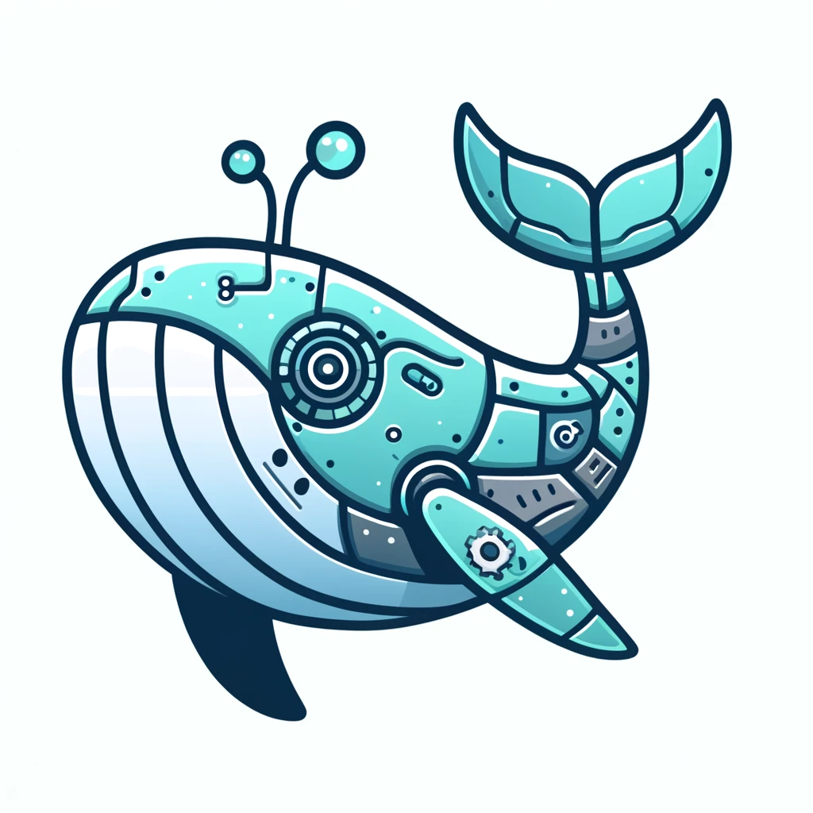

<p align="center">
  
  <h1 align="center">Dokku ChatGPT Assistant</h1>

</p>
<p align="center">
  <a href="https://chatgpt.com/g/g-Ws4EHHX9z-dokku-assistant">
    
  </a>
</p>

Dokku Knowledge Base for OpenAI Custom GPT.

## Documentation Repositories

### Dokku Documentation

This directory contains the Markdown files of the official Dokku documentation.

- Directory: `./dokku`
- [README](./dokku/README.md)
- [Repository](https://github.com/dokku/dokku)

### Nginx Documentation

This directory contains the XML files of the official Nginx documentation.

- Directory: `./nginx`
- [README](./nginx/README.md)
- [Repository](https://github.com/nginx/nginx.org)

## Contribute

```
make update
```
